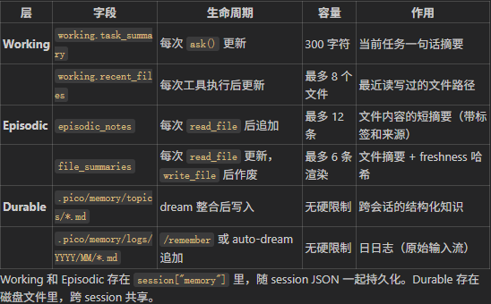
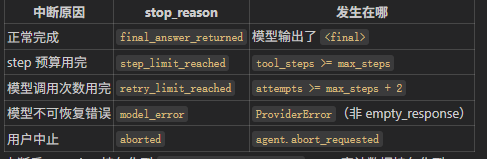
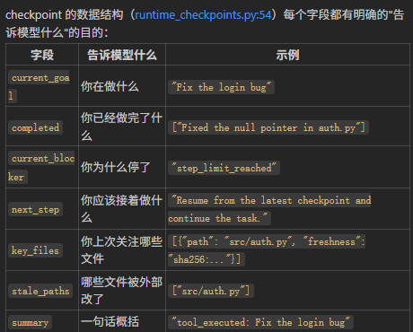

# AgentLoop

## 1.Tool
1. 工具存在性检测 
2. pydantic 工具参数校验
3. 重复工具检测
    从本轮历史记录中查找工具调用，取出同参数同名的工具调用历史。
    如何找本轮：最后一次user消息之后的assistant或者tool call消息
    重复非写操作，则拒绝
    写操作，检查上一次是否写失败。如果并非失败，则拒绝

## 2. Plan Mode

### 目标
让 Agent 在动手执行前先分析现状、制定计划，由用户审批后再执行。

### 交互流程

```
/plan <主题>               ← 用户发起
  │
  ├─ Agent 进入 Plan Mode
  │   ├─ 系统提示追加计划模式约束
  │   ├─ 运行时 mode 切换为 "plan"
  │   ├─ tool 白名单: read_file（只读）
  │   ├─ tool 灰名单: write_file 仅限 .jarvis/plans/<主题>-plan.md
  │   └─ 其他工具: 全部拒绝（包括 run_shell）
  │
  ├─ Agent 探索代码、分析、写出计划文件
  │   └─ 写完后返回 <final>
  │
  ├─ 用户看到计划全文
  │   ├─ /execute  → 退出 Plan Mode
  │   │               ├─ 将 plan.md 内容注入系统提示
  │   │               └─ 恢复正常工具权限，开始执行
  │   └─ /cancel   → 丢弃计划，退出 Plan Mode
  │
  └─ 执行阶段
      ├─ 系统提示包含: "以下是被批准的执行计划:\n{plan.md 内容}"
      └─ 工具白名单恢复为 default（所有工具可用）
```

### 实现要点

#### 1. Agent mode 切换
- `Agent` 增加 `mode: str` 属性，值为 `"default"` 或 `"plan"`
- CLI 的 `/plan <topic>` 命令将 mode 设为 `"plan"`，记录 plan topic
- CLI 的 `/execute` 和 `/cancel` 将 mode 设回 `"default"`

#### 2. ToolExecutor 按 mode 过滤工具

在 `ToolExecutor.execute()` 的开始增加 mode 过滤：

| mode | read_file | write_file（普通路径） | write_file（plans/* 路径） | run_shell | 其他工具 |
|---|---|---|---|---|---|
| default | ✅ | ✅ | ✅ | ✅ | ✅ |
| plan | ✅ | ❌ | ✅ | ❌ | ❌ |

实现方式：`ToolExecutor` 新增 `allowed_tools(mode: str) -> set[str]` 方法，根据 mode 返回当前白名单。`execute()` 调用前先校检工具名是否在白名单中，不在则直接返回拒绝结果。

注意：Plan mode 拒绝工具不走审批流程（approval check），因为这是策略级别的限制，不是操作级别的确认。

#### 3. 计划文件路径
- 固定前缀: `.jarvis/plans/`
- 文件名: `{topic}-plan.md`，其中 topic 为 `/plan <topic>` 的参数做 slugify（小写、短横线、去特殊字符）
- 例如 `/plan 重构auth模块` → `.jarvis/plans/重构auth模块-plan.md`

#### 4. 执行阶段注入计划
- `/execute` 时，读取 `.jarvis/plans/{topic}-plan.md` 内容
- 调用 `ctx.inject_plan(plan_content)` 将计划追加到系统提示末尾
- inject_plan 只需更新 `_messages[0]["content"]`，与 rebuild_system_prompt 方式相同
- 后续模型每次调用都能看到计划内容

#### 5. 涉及文件
| 文件 | 改动 |
|---|---|
| `src/cli.py` | 增加命令: `/plan <topic>`, `/execute`, `/cancel` |
| `src/agent.py` | 增加 `mode` 属性、`topic`、`plan_path` |
| `src/engine/executor.py` | 增加 `allowed_tools(mode)`, `execute()` 中增加 mode 过滤 |
| `src/context/manager.py` | 增加 `inject_plan(content)` |
| `src/engine/loop.py` | 构造 prompt 时如果 mode=plan 注入 plan 约束 |
    如果上次没写成功，有没有成功再读取一遍？
    如果没读成功就又修改，则拒绝
4. 权限校验
    白名单过滤
    模式过滤
    工具具体操作对象过滤
5. 策略检查
    主要是避免AI上下文中的文件与磁盘文件不一致。
    将路径指向的文件与AI记忆中的进行指纹对比。
    同时约束shell命令只能通过指定工具执行


## 2.上下文治理
- 模型能安全执行工具了，但还有一个根本问题：模型看到的信息可能是错的或不完整的。
    两个子问题：
-    ② 文件被外部改了，模型还拿着旧版本的信息在决策
-   ③ prompt 太长，塞不进模型的上下文窗口

### 解决
1. tool_policy._has_fresh_read() 在 patch_file/write_file 执行前比对 freshness。不匹配 → 拒绝 → 模型被迫先 read_file 拿到最新内容
2. 每次构建 prompt 前，扫一遍 memory 中的 file_summaries，把 freshness 跟磁盘对不上的清掉。这样 prompt 中 memory section 不会包含过时的文件摘要。
3. checkpoint 校验时检测

    evaluate_resume_state() 遍历 checkpoint 的 key_files，比对 freshness。有变化的路径记入 stale_paths，状态标记为 partial-stale，触发 checkpoint 重建。
    **三道防线的分工：**
    防线 1（tool_policy）  → 单次工具调用级别的拦截，保护本次操作
    防线 2（invalidate）   → prompt 级别的清理，保护本次模型调用看到的信息
    防线 3（evaluate）     → session 级别的检测，保护下次 resume 的锚点

4. 上下文预算
- 分 section 预算 + 按优先级压缩
1. 压缩策略
当 prompt 总长度超过 total_budget（默认 60000 chars）时，
context_manager.py:146 的 reduction loop 按固定优先级压缩

2.当 history 太长时，compact.py 做结构化压缩


## Memory介绍
```python
{
  "working": {
    "task_summary": "Fix the login bug",
    "recent_files": ["src/auth.py", "tests/test_auth.py", "src/models/user.py"]
  },
  "episodic_notes": [
    {
      "text": "auth.py uses null-check pattern for token validation",
      "tags": ["src/auth.py"],
      "source": "src/auth.py",
      "created_at": "2026-06-05T14:30:22",
      "note_index": 0,
      "kind": "episodic"
    }
  ],
  "file_summaries": {
    "src/auth.py": {
      "summary": "def login(request): token = request.headers.get('Authorization')",
      "created_at": "2026-06-05T14:30:22",
      "freshness": "sha256:abc123..."
    }
  },
  "task": "Fix the login bug",
  "files": ["src/auth.py", "tests/test_auth.py", "src/models/user.py"],
  "notes": ["auth.py uses null-check pattern for token validation"],
  "next_note_index": 1
}
其中 task、files、notes 是旧格式镜像，从 working 和 episodic_notes 派生，为了兼容早期 session 数据。实际读写都走 working 和 episodic_notes。
```



## 生命周期管理
> Runtime恢复和模型恢复是两码事


### Jarvis自身状态恢复
Runtime恢复，重建总线、工具、系统提示等等，这些是Runtime自身状态恢复

### Checkpoint模型自身恢复

